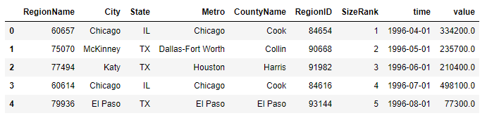

# Zillow Real Estate Time Series
## Data Understanding: 
The Zillow real estate dataset, available in the file zillow_data.csv, is a comprehensive collection of median housing sales values for various zip codes. The dataset follows the Wide Format, where columns represent median sales values for specific months and years. While this format is intuitive, it presents challenges for effective machine learning due to its reliance on metadata-dependent column names.

To address these challenges, the data undergoes a transformation from Wide to Long Format using the pd.melt() method. In the Long Format, each row corresponds to a unique time and zipcode combination, enhancing compatibility with machine learning algorithms.

The transition to Long Format is pivotal for unleashing the potential of the Zillow real estate dataset. By reshaping the data, we create a structure that enhances machine learning compatibility, making it suitable for models like ARIMA. This transformation ensures effective utilization of temporal patterns, providing valuable insights and accurate forecasting capabilities.

You'll notice that the first seven columns look like any other dataset you're used to working with. However, column 8 refers to the median housing sales values for April 1996, column 9 for May 1996, and so on. This This is called **_Wide Format_**, and it makes the dataframe intuitive and easy to read. However, there are problems with this format when it comes to actually learning from the data, because the data only makes sense if you know the name of the column that the data can be found it. Since column names are metadata, our algorithms will miss out on what dates each value is for. This means that before we pass this data to our ARIMA model, we'll need to reshape our dataset to **_Long Format_**. Reshaped into long format, the dataframe above would now look like:

There are now many more rows in this dataset--one for each unique time and zipcode combination in the data! Once our dataset is in this format, we'll be able to train an ARIMA model on it. The method used to convert from Wide to Long is `pd.melt()`, and it is common to refer to our dataset as 'melted' after the transition to denote that it is in long format. 
