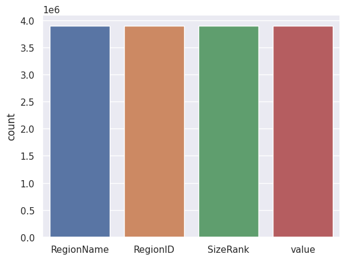
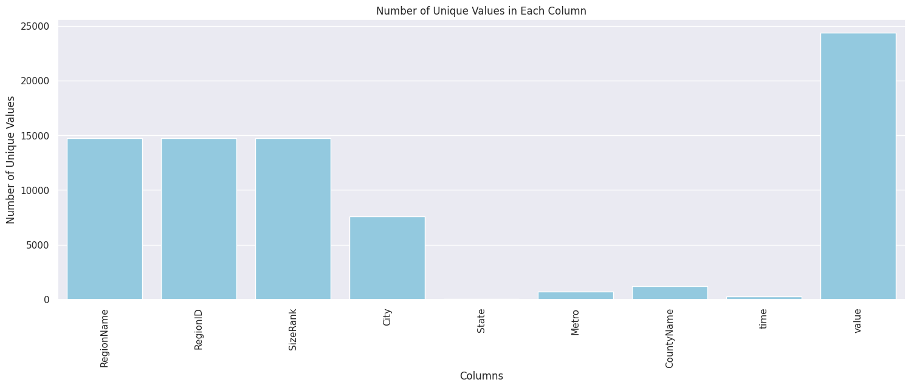
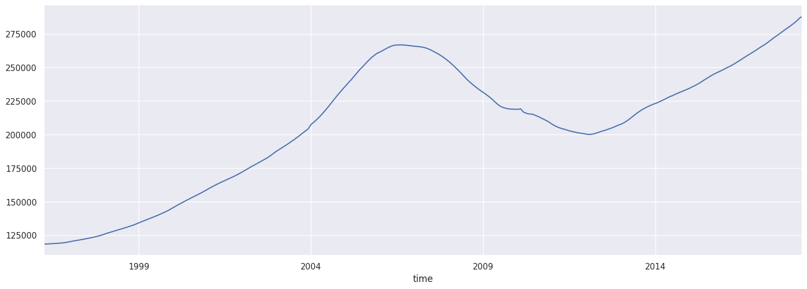

# Zillow Real Estate Time Series
## Data Understanding: 
The Zillow real estate dataset, available in the file zillow_data.csv, is a comprehensive collection of median housing sales values for various zip codes. The dataset follows the Wide Format, where columns represent median sales values for specific months and years. While this format is intuitive, it presents challenges for effective machine learning due to its reliance on metadata-dependent column names.

To address these challenges, the data undergoes a transformation from Wide to Long Format using the pd.melt() method. In the Long Format, each row corresponds to a unique time and zipcode combination, enhancing compatibility with machine learning algorithms.

The transition to a Long Format is pivotal for unleashing the potential of the Zillow real estate dataset. By reshaping the data, we create a structure that enhances machine learning compatibility, making it suitable for models like ARIMA. This transformation ensures effective utilization of temporal patterns, providing valuable insights and accurate forecasting capabilities.

You'll notice that the first seven columns look like any other dataset you're used to working with. However, column 8 refers to the median housing sales values for April 1996, column 9 for May 1996, and so on. This is called **_Wide Format_**, and it makes the dataframe intuitive and easy to read. However, there are problems with this format when it comes to actually learning from the data because the data only makes sense if you know the name of the column where the data can be found. Since column names are metadata, our algorithms will miss out on what dates each value is for. This means that before we pass this data to our ARIMA model, we'll need to reshape our dataset to **_Long Format_**. Reshaped into the long format, the data frame above would now look like this:

After reshaping the data, we perform a comprehensive analysis to detect and evaluate any missing values in the dataset. For this examination, we utilize Seaborn's countplot to visualize the distribution of missing values.

We have also investigated the number of unique values in the dataframe, focusing on key columns such as RegionID, RegionName, City, State, and Metro, time, value, and also county name 

We have also generated a plot illustrating the connection between time and the mean values i

## Objective:
### Main Objective
- To forecast real estate prices for various zip codes using the Zillow Research dataset.
### Specific objective

- To convert the dataset from Wide Format to Long Format using pd.melt() to enhance compatibility with time series models.

- To conduct exploratory data analysis to understand the temporal patterns and identify any underlying trends, seasonality, or irregularities in the data.
Missing Values Analysis:

- To utilize univariate time series models, such as ARIMA, to capture and forecast the temporal patterns of individual zip codes.
Multivariate Time Series Modeling:

- To explore multivariate time series models, considering factors like seasonality, economic indicators, and other relevant features to improve forecasting accuracy.
Model Evaluation:

- To evaluate the performance of time series models using appropriate metrics, ensuring reliability and effectiveness in predicting real estate prices.

- To determine the top 5 zip codes for investment based on the forecasted real estate prices, considering profit margins, risks, and other relevant factors.
Documentation and Reporting:
